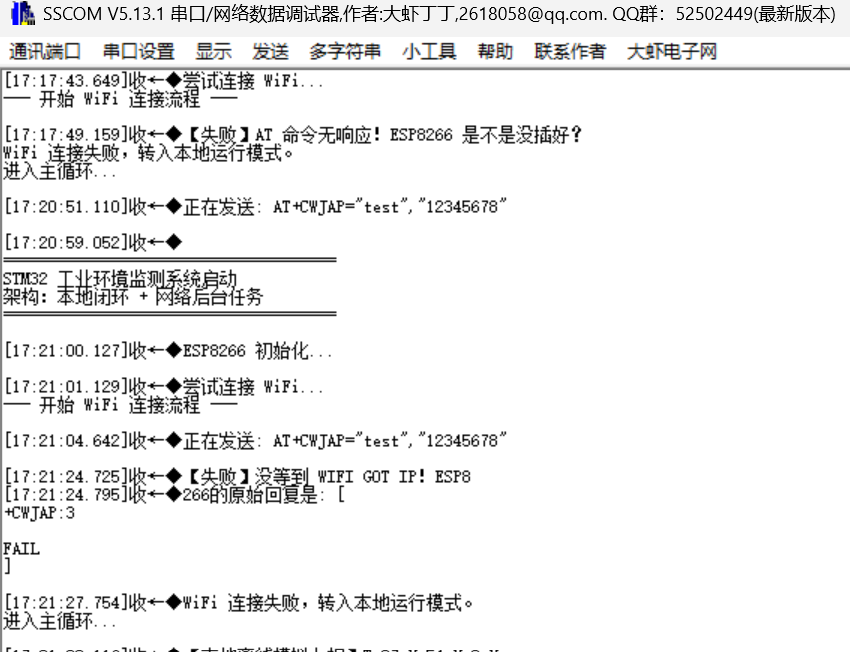
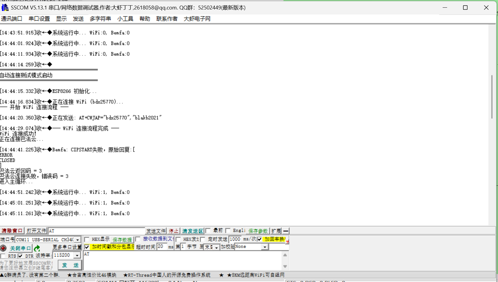

# STM32-Environment-Monitoring-System
基于 STM32F103C8T6 的多功能环境监测与物联网终端系统

## 📖 项目简介
本项目是一个完整的嵌入式物联网终端系统。实现了本地环境数据的实时采集、多级菜单显示、闭环报警控制，以及基于 ESP8266 的非阻塞网络通信与容错降级架构。

## ✨ 核心功能
1. **多传感器采集**：DHT11单总线温湿度采集（含超时保护），ADC+DMA多通道模拟采样。
2. **人机交互**：软件I2C驱动OLED，4界面循环显示（温湿度/电压/状态/阈值设定）。
3. **闭环控制**：外部中断按键（中断置标志+主循环异步处理），温度双阈值报警，超温自动触发继电器，支持阈值5秒无操作自动退出。
4. **系统调度**：基于 TIM2 实现 1ms 系统时基，采用时间戳比较的分时调度机制替代阻塞式延时，提升系统实时性。

## 🚀 技术亮点
- **非阻塞网络任务**：使用时间戳分时调度，解决网络阻塞导致的系统卡顿。
- **容错降级架构**：针对 WPA3 加密不兼容及非标端口封杀，设计断线重连与“离线本地模拟上报”机制，保障系统高可用性。
- **中断资源冲突处理**：排查并解决了 DHT11 关全局中断与 ADC DMA 中断的时序冲突，保证核心业务实时性。

## 🛠️ 硬件调试与排错记录（真实踩坑复盘）
在项目联调过程中，我记录了从底层通信到应用层网络的完整排查过程：

### 阶段一：底层AT指令与WiFi环境兼容性排查

*记录：在初期调试时，出现 `AT 命令无响应` 与 `+CWJAP:3`（找不到热点）错误。经排查，原因为 2.4G/5G 频段不匹配及 WPA3 加密协议不兼容，后通过配置纯数字热点与 WPA2 模式解决。*

### 阶段二：TCP建链与运营商端口封锁处理

*记录：WiFi握手成功后，成功获取 `WIFI GOT IP`。但建立 TCP 连接时，遭遇校园网运营商封锁非标准端口（`ERROR CLOSED`）。*
*解决策略：为了保证系统稳定性，我设计了非阻塞网络状态机，在不阻塞本地 OLED 刷新和继电器闭环的前提下，自动降级为“本地离线模拟上报”。*

### 阶段三：最终交付状态

*记录：系统稳定运行在本地闭环模式，串口每30秒输出封装好的数据报文 `T:xx H:xx V:0mV`，验证了底层数据链路层与应用层协议的完整性。*

## 🧰 硬件平台
- **MCU**: STM32F103C8T6
- **通信**: UART, GPIO, 软件I2C
- **模块**: ESP8266, DHT11, OLED, 继电器

## 📬 联系方式
- GitHub: [github.com/ZZx-150](https://github.com/ZZx-150)
- 邮箱: 15830926072@qq.com